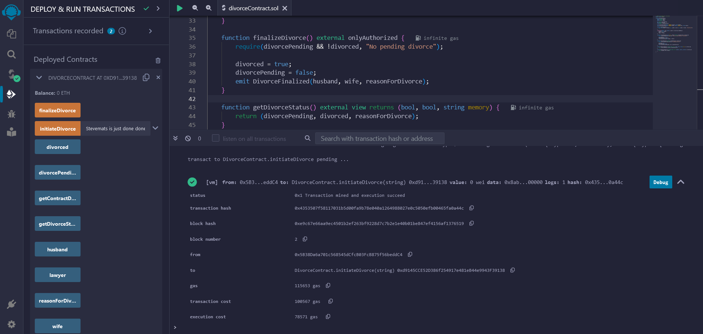
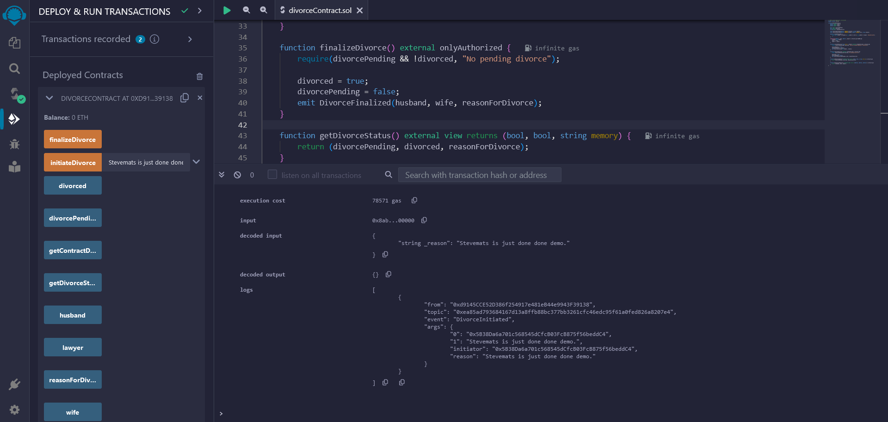
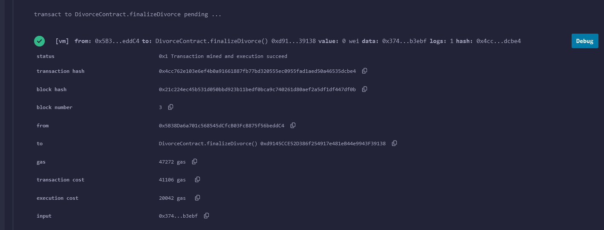
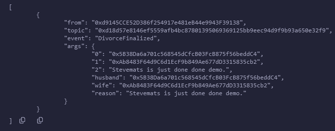
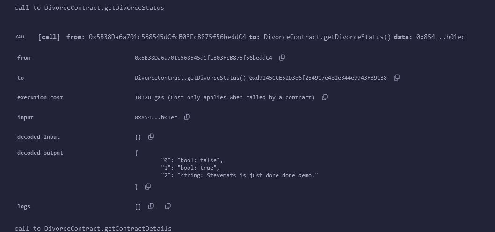
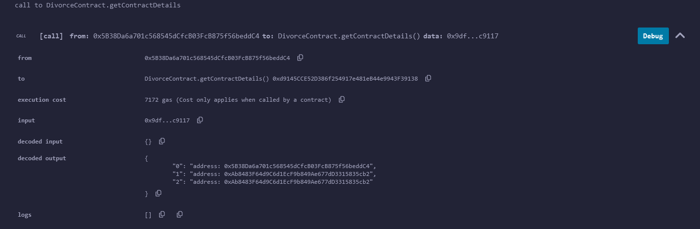
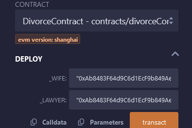

# SmartDivorce Contract(SDC)

SDC is a smart contract deployed on the Ethereum blockchain, designed to facilitate divorce proceedings in a decentralized, transparent, and secure manner. This contract allows parties involved in a divorce (husband, wife, and their lawyer) to initiate and finalize divorce proceedings, while ensuring privacy, fairness, and enforceability of the process.

## Features

- **Initiation of Divorce Proceedings:** Any authorized party (husband, wife, or their lawyer) can initiate divorce proceedings by providing a reason for divorce.
- **Finalization of Divorce:** Once divorce proceedings are initiated, any authorized party can finalize the divorce, marking the end of the proceedings.

- **Privacy Protection:** The contract ensures privacy by allowing only authorized parties to interact with it. Sensitive information such as reasons for divorce is stored securely on the blockchain.

- **Transparency:** All actions taken within the contract, including the initiation and finalization of divorce proceedings, are recorded on the blockchain and can be verified by all parties involved.

- **Security:** Robust security measures are implemented to prevent unauthorized access and ensure the integrity of the divorce proceedings.

## Smart Contract Functions

1. **initiateDivorce(string \_reason):** Initiates divorce proceedings with the provided reason. Only authorized parties can call this function.
   

2. **finalizeDivorce():** Finalizes the divorce proceedings. Only authorized parties can call this function.

3. **getDivorceStatus():** Retrieves the current status of divorce proceedings, including whether divorce is pending or finalized, and the reason for divorce (if provided).

4. **getContractDetails():** Retrieves the addresses of the husband, wife, and lawyer involved in the divorce proceedings.

## Usage

1. **Deployment:** Deploy the Divorce Contract smart contract on the Ethereum blockchain using [Remix IDE](https://remix-ide.readthedocs.io/en/latest/compile.html) available at remix[.]ethereum[.]com at the time of this writing, or use other Ethereum development environments.

2. **Initialization:** Provide the Ethereum addresses of the wife and lawyer as constructor arguments during contract deployment.

3. **Interact with the Contract:** Authorized parties (husband, wife, and lawyer) can interact with the contract by calling its functions using their Ethereum accounts.

4. **Testing:** Use Remix IDE or other Ethereum development tools to test the contract's functionalities in a simulated environment before deploying it in a real-world scenario.

---

---

> Considerations you should look into if you come accross this project & think of improving on it:

## Security Considerations

- **Access Control:** Implement proper access control mechanisms to ensure that only authorized parties (husband, wife, and lawyer) can initiate or finalize divorce proceedings.
- **Secure Transactions:** Use secure communication channels and cryptographic techniques to protect sensitive information and prevent unauthorized access to Ethereum accounts.
- **Code Auditing:** Regularly audit the smart contract code for security vulnerabilities and employ best practices in smart contract development to minimize the risk of exploitation.
- **Emergency Stop Mechanism:** Consider implementing an emergency stop mechanism to halt contract operations in case of unforeseen security threats or vulnerabilities.

## Legal Compliance

- **Consultation with Legal Experts:** Consult with legal experts to ensure that the Divorce Contract complies with relevant laws and regulations in the jurisdiction where it will be used.
- **Privacy Regulations:** Address any legal concerns related to data privacy and protection of personal information stored on the blockchain.
- **Enforceability:** Ensure that the decisions and actions taken within the contract are legally enforceable in the relevant jurisdiction, and consider the implications of blockchain technology on traditional legal frameworks.

## Impovable Areas //ToDo

- **Multi-Signature Functionality:** Implementing a multi-signature functionality to require multiple parties to sign off on important actions such as initiating or finalizing divorce proceedings, enhancing security and accountability.
- **Arbitration Mechanism:** Integrating an arbitration mechanism to resolve disputes that may arise during divorce proceedings, providing an alternative to traditional legal processes.
- **Integration with Legal Services:** Partnering with legal service providers to offer additional services such as legal advice, document preparation, and dispute resolution through the Divorce Contract platform.
- **Enhanced Privacy Options:** Exploring advanced privacy-preserving techniques such as zero-knowledge proofs or secure multi-party computation to further protect sensitive information while maintaining transparency and accountability.

---

Project Page

> [Github](https://github.com/stevemats) - https://github.com/stevemats/SmartDivorceContract

---
